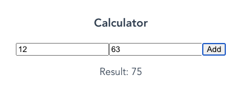

## Erste Schritte mit Vue 3 und der Composition API

Die lang erwartete Version 3 des beliebten JavaScript Frameworks Vue.js ist noch nicht offiziell freigegeben worden und dennoch wird der aktuelle [Release Candidate](https://github.com/vuejs/vue-next/tags){:target="_blank"} bereits ausgiebig getestet und verwendet. 
Wenn du dich fragen solltest, was die Hauptmerkmale und wichtigsten Änderungen von Vue 3 sind, bist du hier schon einmal richtig. Da bereits die Ankündigung der neuen Composition API zu einigen Kontroversen führte, welche mittlerweile zur Zufriedenheit aller aufgehoben werden konnten, wird in diesem Artikel hauptsächlich diese neue API näher beleuchtet.

Obwohl das finale Release erst im dritten Quartal 2020 erwartet wird, kann die Composition API über ein Plugin bereits jetzt in bestehende Vue Anwendungen integriert und verwendet werden. 
In diesem Artikel sollen unter anderem die folgenden Fragen geklärt werden:

* Was verbirgt sich hinter der Composition API?
* Warum wurde die Composition API eingeführt?
* Wie funktioniert die Composition API? 

Am Ende werden wir zwei Versionen derselben Komponente erstellt haben: Eine mit der Composition-API und eine mit der Options API, dem aktuellen Standard zum Schreiben von Komponenten in Vue.js.

<hr>
<div class="workshop-hint">
  <div class="h3">Keine Lust zu Lesen?</div>
  <div class="row mb-2">
    <div class="col-xs-12 col-md-6">
      <p>
        Nicht jeder lernt am besten aus Büchern und Artikeln. Lernen darf interaktiv sein und Spaß machen. Wir bieten euch auch
        <a target="_blank" href="https://workshops.de/seminare-schulungen-kurse/vuejs-typescript?utm_source=vuejs.de&utm_campaign=tutorial&utm_medium=link&utm_content=text-top">Vue Intensiv Schulungen</a> an, falls Ihr tiefer in die Thematik einsteigen wollt.
      </p>
      <p class="">
        <a target="_blank" href="https://workshops.de/seminare-schulungen-kurse/vuejs-typescript?utm_source=vuejs.de&utm_campaign=tutorial&utm_medium=button&utm_content=text-top">
          <button class="btn btn-danger">Mehr Informationen zur Schulung</button>
        </a>
      </p>
    </div>
    <div class="col-xs-12 col-md-6">
      
    </div>
  </div>
</div>
<hr>  

## Was verbirgt sich hinter der Composition API?
Das wichtigste Vorweg: **Die neue API ist rein additiv, bricht vorhandenen Code nicht und muss darüber hinaus auch gar nicht verwendet werden!**
Es kann weiterhin mit der Options API gearbeitet werden. Die neue Composition API ist lediglich eine Erweiterung des bestehenden Frameworks, um Einschränkungen von Vue 2.x, welche speziell bei großen Anwendungen aufkamen, zu beheben.
Die Composition API bietet eine Möglichkeit die aus Vue bekannte [Reactivity](https://vuejs.org/v2/guide/reactivity.html){:target="_blank"} in allen Teilen der Anwendung nutzbar zu machen, ohne die Organisation und Lesbarkeit zu beeinträchtigen. 

Im Grunde genommen fügt die Composition API dem Framework nichts Neues hinzu. Sie stellt uns einige der ursprünglich lediglich intern verwendeten Funktionen zur Verfügung, um diese direkt innerhalb und außerhalb von Komponenten nutzen zu können.

Der Begriff _Composition_ beschreibt dabei einen weiteren wesentlichen Teil, nämlich das es auch den Aufbau von Komponenten vereinfacht. Es handelt sich um eine Möglichkeit, wie Teile zusammengesetzt werden können, damit am Ende eine Komponente entsteht. 

## Warum die neue API?
Mit zunehmender Größe und Komplexität sind Vue-Projekte und speziell darin befindliche Komponenten schwer zu warten und verwalten gewesen. In Vue 2.x werden Komponenten mithilfe verschiedener Optionen (_data_, _methods_, _computed_,...) organisiert, daher Options API. 
Zusätzlich dazu besteht noch eine Vielzahl sogenannter _Lifecycle_-Methoden, die ebenfalls hinzugenommen werden können, um auf bestimmte Situationen reagieren und sogar eingreifen zu können.

Aufgrund dieser Einteilung sind Komponenten mit steigender Größe schwer zu lesen, da man häufig zwischen den einzelnen Abschnitten hin- und herspringt, um die Funktionsweise nachvollziehen zu können.
Ein weiterer Nachteil dieser Organisation ist, dass sie die Wiederverwendung von Code erschwert, da ein Feature über die gesamte Datei verstreut sein kann. Es existieren zwar diverse Lösungsmöglichkeiten, welche alle aber wiederum eigene Nachteile mit sich bringen.

Die [offizielle Vue Dokumentation](https://v3.vuejs.org/guide/composition-api-introduction.html#why-composition-api){:target="_blank"} enthält dieses ausgezeichnete Diagramm, das die Zusammengehörigkeit verschiedener Features in derselben Komponente durch die Verwendung verschiedener Farben sichtbar macht:


Als weiterer wichtiger Punkt ist der aktuelle TypeScript Support zu nennen. Die Options-API beruht auf einer Menge "Magie" des Vue-Compilers, wodurch sich die Verwendung von `this` innerhalb von Komponenten nur sehr schwierig mit TypeScript verbinden lässt.
Die Composition API ist aufgrund Ihrer Struktur und Simplizität frei von diesen Nachteilen, sodass sie sich wie in JavaScript erwartet verhält. Dies ermöglicht eine viel bessere TypeScript-Unterstützung bei der Verwendung der Composition API.

## Vue 3
Es existieren verschiedene Möglichkeiten Vue 3 zu installieren. 
Da das Team von Vue ein offizielles [CLI](https://cli.vuejs.org){:target="_blank"} anbietet, um eine Anwendung aufzusetzen und dies in der Regel auch der optimale Weg ist, wird an dieser Stelle auch darauf zurückgegriffen.
Zu Beginn müssen wir uns das CLI zum Beispiel über den [Node Package Manager](https://www.npmjs.com/get-npm){:target="_blank"} installieren:

```shell
npm install -g @vue/cli@next
```

Das Erstellen eines neuen Projektes erreichen wir dann über die folgende Zeile:

```shell
vue create vue-3-tutorial
```

Als Preset wählen wir hier **Default (Vue 3 Preview)**. Daraufhin findet das Aufsetzen und Konfigurieren unseres neuen Projektes statt. Sobald der Vorgang abgeschlossen ist, werden auch schon die nächsten Schritte zum Ausführen der Vue Anwendung angezeigt:

```shell
cd vue-3-tutorial
yarn serve
# OR
npm run serve
```

Im Browser lässt sich die laufende Anwendung dann über die angezeigte URL aufrufen, welche standardmäßig [http://localhost:8080/](http://localhost:8080/){:target="_blank"} lautet.

### 1. Bootstrapen der Anwendung
Die Art und Weise wie eine neue Vue Anwendung erstellt wird, hat sich mit Version 3 geändert. Dazu schauen wir uns die Datei `src/main.js` einmal mit einem beliebigen Editor genauer an.

```javascript
import { createApp } from 'vue';
import App from './App.vue';

createApp(App).mount('#app');
```

Anstatt mit `new Vue` wird jetzt die `createApp` Funktion verwendet, welche zunächst importiert werden muss.
Der Funktion wird als erster Parameter unsere Root-Komponente, also die Wurzel unserer Anwendung übergeben. 
Die Komponente kann hier definiert oder wie in der Beispielanwendung (`App.vue`) importiert werden.
Mittels `mount` Aufruf und der Übergabe eines CSS-Selektors, teilen wir Vue mit, wo unsere Anwendung respektive Komponente im DOM gemountet werden soll. 

Die HTML-Datei, in welcher sich das Element mit der ID _app_ finden lässt, befindet sich unter `public/index.html`. Sobald der Browser die HTML-Datei und die zugehörigen Ressourcen heruntergeladen und ausgeführt hat, wird unsere Vue-Anwendung in das Div-Element mit der ID _app_ geladen.

### 2. Unsere erste Komponente
Wir werden eine einfache Komponente zur Addition zweier Zahlen erstellen. Das vorläufige Ergebnis wird dabei so aussehen:



Im `components`-Ordner erstellen wir dazu zunächst eine neue Datei mit dem Namen `Calculator.vue`:

```vue
<template>
    <h3>Calculator</h3>
    <form>
        <input type="number">
        <input type="number">
        <button type="button">
            Add
        </button>
    </form>
    <p>Result: </p>
</template>
<script></script>
<style></style>
```

#### 1. Der Aufbau einer Komponente
Der Aufbau der Datei folgt dem bekannten [Single-File-Component](https://vuejs.org/v2/guide/single-file-components.html){:target="_blank"}-Schema, welches der de-facto Standard für Vue Anwendungen ist. 

Das `template` stellt das zu rendernde HTML der Komponente dar und kann unter anderem mit [Direktiven](https://vuejs.org/v2/guide/syntax.html#Directives){:target="_blank"} und [Interpolations](https://vuejs.org/v2/guide/syntax.html#Interpolations){:target="_blank"}) angereichert werden, um Logik abzubilden. Dieses Vorgehen unterscheidet sich nicht wirklich von anderen Template-Engines.

Der `script`-Teil wird für die "komplexere" JavaScript-Logik der Komponente verwendet und um die Komponente zu konfigurieren.

Im `style`-Tag werden schließlich die CSS Regeln für diese Komponente hinterlegt. Verwendet man allerdings nicht das Attribut `scoped`, so beziehen sich dort angegebene Regeln auf die gesamte Anwendung. Hier bietet es sich an eine weiterführende Methodik wie [BEM](http://getbem.com/introduction/){:target="_blank"} einzusetzen. 
Da dies den Umfang des Tutorials sprengen würde, entfernen wir im Folgenden die `style`-Tags und kümmern uns hier lediglich um die Logik der Komponente.

#### 2. Schreiben des `script`-Teils

Unsere Komponente benötigt drei Variablen. `num1` und `num2` werden für die Eingabewerte des Benutzers benötigt und `sum` beinhaltet das Ergebnis der Addition. Über die `data`-Option können wir einer Komponente Zustandsvariablen zuweisen.

Dazu erweitern wir den `script`-Teil der Datei wie folgt:

```javascript
export default {
  data() {
    return {
      num1: 0,
      num2: 0,
      sum: 0,
    };
  }
}
```

Um die Addition auszuführen, verwenden wir noch eine Methode. Diese wird wie gewohnt in `methods` deklariert:

```javascript
export default {
  data() {
    return {
      num1: 0,
      num2: 0,
      sum: 0,
    };
  },
  methods: {
    add: function () {
      this.sum = parseInt(this.num1) + parseInt(this.num2);
    }
  }
}
``` 

An dem Beispiel sehen wir auch die Verwendung von `this`. Der Vue-Compiler kümmert sich darum, dass Optionen über das `this` aufeinander zugreifen können und alle in `data` definierten Variablen auch initialisiert werden und dem Kontext zur Verfügung stehen.  

Damit ist der `script`-Teil zunächst fertig. Als Nächstes geht es darum, dass wir die Steuerung der Anzeige ins Template integrieren.

#### 3. Die Anreicherung des `template`-Teils

Als Erstes kümmern wir uns um die Ausgabe des Ergebnisses `sum`, da es sich hierbei lediglich um eine einfache Textinterpolation handelt. Als Syntax verwendet Vue die sogenannte _Mustache_ Syntax, bei welcher es sich um zwei geschweifte Klammern handelt:

```html
<template>
    <h3>Calculator</h3>
    <form>
        <input type="number">
        <input type="number">
        <button type="button">
            Add
        </button>
    </form>
    <p>Result: {{ sum }}</p>
</template>
```

Der Vue-Compiler rendert an die Stelle von `sum` den Inhalt der Variable aus `data`. Genau genommen passiert hier noch mehr. Als Nutzer des Frameworks erhält man out-of-the-box eine [Reaktivität](https://vuejs.org/v2/guide/reactivity.html){:target="_blank"} der Eigenschaften. 
Alles, was in `data` definiert worden ist, wird automatisch mit einem Watcher versehen, sodass Änderungen an den dort definierten Variablen zu einem Re-rendering des Templates führen.

Neben der Ausgabe einer aktuell noch unveränderlichen Summe der Addition, sollten wir uns nun viel mehr um die Verknüpfung der Eingabefelder mit unseren anderen beiden Variablen `num1` und `num2` kümmern.

Die Template-Engine bietet uns dafür sogenannte Direktiven an, welche Seiteneffekte auf das DOM anwendet. Diese speziellen Direktiven beginnen immer mit dem Präfix `v-` und dürfen als Wert lediglich einfache JavaScript-Ausdrücke beinhalten.

Für unseren Anwendungsfall hier benötigen wir eine Möglichkeit eine bidirektionale Bindung zwischen dem Eingabefeld und der zugehörigen Variable zu erstellen. Vue bietet uns hierfür die `v-model` Direktive an:

```html
<template>
    <h3>Calculator</h3>
    <form>
        <input type="number" v-model="num1">
        <input type="number" v-model="num2">
        <button type="button">
            Add
        </button>
    </form>
    <p>Result: {{ sum }}</p>
</template>
```

Vue sorgt dann dafür, dass die Eingaben des Users in das Eingabefeld in der angegebenen Variable reflektiert werden. Ebenso würden Codeseitige Änderungen an den Variablen dazu führen, dass die Eingabefelder im Browser ebenfalls entsprechend aktualisiert werden.

Letztlich fehlt noch die Ausführung der Addition bei einem Klick auf den Button. Wir können die `v-on`-Direktive verwenden, um auf DOM Events zu lauschen und JavaScript-Code ausführen, wenn sie ausgelöst werden. Die Art des Events wird hinter einem Doppelpunkt angegeben.

```html
<template>
    <h3>Calculator</h3>
    <form>
        <input type="number" v-model="num1">
        <input type="number" v-model="num2">
        <button type="button" v-on:click="add">
            Add
        </button>
    </form>
    <p>Result: {{ sum }}</p>
</template>
``` 

Bei einem Klick auf den Button wollen wr unsere `add` Methode ausführen, um `sum` den Wert der Addition von `num1` und `num2` zuzuweisen und damit ein Re-rendering der Komponente auszulösen. `v-on` kann und sollte für eine bessere Lesbarkeit durch ein `@` ersetzt werden, sodass man `@click="sum"` erhält.

#### Multi-root templates

Seit Vue 3 ist es dank einer Funktion namens _fragments_ nicht mehr zwingend erforderlich, ein einziges Wurzelelement im `template` zu haben.
Diese Änderung führt dazu, dass der oben gezeigte Code nun endlich valide ist und nicht extra ein umschließendes `div` hinzugefügt werden muss, wie es in 2.x noch der Fall war.

### 3. Einbinden unserer Komponente

Um unsere Komponente testen zu können, müssen wir diese in unserer Anwendung einbinden und verwenden. Dafür öffnen wir `src/App.vue` und importieren zunächst unsere Komponente, indem wir im `script`-Teil über den `export` die folgende Zeile hinzufügen:

```javascript
import Calculator from './components/Calculator.vue';
```

Unsere Komponente müssen wir nun noch als solche registrieren und der Anwendung bekannt machen. Dafür bietet die Options API eine weitere Eigenschaft, nämlich `components`. 

`components` ist ein Objekt, welches als Key den Namen des Tags und als Wert die Komponente bzw. das Konfigurationsobjekt selbiger beinhaltet:

```javascript
export default {
  name: 'App',
  components: {
    Calculator
  }
}
```

Hier verwenden wir die [Kurzschreibweise](https://developer.mozilla.org/en-US/docs/Web/JavaScript/Reference/Operators/Object_initializer#Property_definitions){:target="_blank"}, welche seit ECMAScript 2015 (ES6) verwendet werden kann, indem wir lediglich `Calculator` angeben.

Im `template`-Teil unserer Root-Komponente `App` können wir nun an beliebiger Stelle `<Calculator />` verwenden, um dort unsere Komponente rendern zu lassen:

```html
<template>
  <div id="app">
    <Calculator />
  </div>
</template>
```

## Refactoring mit der Composition API

Zu Demonstrationszwecken soll diese recht überschaubare Komponente zunächst reichen. Neben einigen anderen Neuerungen von Vue 3, wollen wir uns jetzt mit der Composition API auseinandersetzen.

Die neue API ermöglicht es uns, Komponenten mit einer `setup`-Funktion zu definieren, anstatt mit einem großen Objekt, welches aus vorgegebenen Keys (Optionen) besteht. 
Zunächst wollen wir uns ein Refactoring der zuvor erstellen Komponente mit der Composition API ansehen, um daraufhin die letzte offene Frage des Artikels zu beantworten, nämlich wie die Composition API funktioniert.

Die Funktionalität der Komponente wird durch das Refactoring nicht verändert und auch das Template bleibt hiervon vollkommen unberührt, wie wir gleich sehen werden, da sich das Rendern der Komponente nicht von der Art, wie wir die Logik einer Komponente definieren, beeinflussen lässt. 

### 1. Umschreiben der Komponentenlogik

Wie oben angeführt, reduziert sich mit der Composition API die Art der Konfiguration einer Komponente von einem großen Objekt auf eine `setup`-Funktion. Demzufolge starten wir zunächst mit einem Refactoring in folgendes Schema:

```javascript
export default {
  setup() {
  }
}
``` 

Da Vue sich mit der Composition API wieder mehr an die klassische und JavaScript-Entwicklern gewohnte Arbeitsweise annähern soll, unter anderem, um eine bessere TypeScript-Unterstützung zu erreichen, können wir die benötigte Variablen und Funktion innerhalb der `setup`-Funktion wie folgt deklarieren:

```javascript
export default {
  setup() {
    const num1 = ref(0);
    const num2 = ref(0);
    const sum = ref(0);

    function add() {
      sum.value = parseInt(num1.value) + parseInt(num2.value);
    }
  },
}
``` 

Prinzipiell sieht der vorhandene Code bereits jetzt nach gewohntem JavaScript aus, welcher nicht Framework-agnostisch zu sein scheint. Wir benutzen zwar `ref` und müssen die Zuweisung der Variable über ein `.value` vornehmen, nichts davon ist allerdings JavaScript-untypisch.

Geändert hat sich außerdem, dass wir `this` nicht mehr verwenden, um Variablen zu referenzieren. 
Durch die direkte Verwendung der API-Funktionen (`ref`) anstatt über die Optionen wie im vorherigen Beispiel, wird die sonst im Framework stattfindende Magie wegabstrahiert.

Um den Code noch zu komplettieren, müssen wir `ref` natürlich noch importieren, und zwar direkt aus Vue heraus.

```javascript
import { ref } from 'vue';

export default {
  setup() {
    const num1 = ref(0);
    const num2 = ref(0);
    const sum = ref(0);

    function add() {
      sum.value = parseInt(num1.value) + parseInt(num2.value);
    }
  },
}
``` 

Damit ist das Refactoring auch bereits fast abgeschlossen. Was noch fehlt ist, dass wir dem Template die Variablen und Funktion bekannt machen.

So wie wir das in normalen Funktionen auch handhaben, nämlich Eigenschaften mittels eines `return`-Statements zurückgeben, implementieren wir dies hier genau so, da es sich bei `setup` schließlich auch um eine einfache JavaScript-Funktion handelt:

```javascript
import { ref } from 'vue';

export default {
  setup() {
    const num1 = ref(0);
    const num2 = ref(0);
    const sum = ref(0);

    function add() {
      sum.value = parseInt(num1.value) + parseInt(num2.value);
    }
 
    return {
      num1,
      num2,
      sum,
      add,
    };
  },
}
``` 

Wechseln wir nun zurück in den Browser, so sollten wir weiterhin die bereits bekannte Funktionsweise vorfinden.

## Wie funktioniert die neue API?

Die gesamte Reaktivität, welche sonst vom Framework hinter den Kulissen gehandhabt und uns als Nutzer out-of-the-box nahezu magisch zur Verfügung gestellt wird, ist nun mittels einzelner exportierter Funktionen nutzbar.

Im Beispiel sehen wir die Verwendung von `ref`. Auf diese Art machen wir die Variable nun sozusagen händisch **reaktiv**. `ref` akzeptiert einen Wert und gibt daraufhin eine [Reactive Reference](https://v3.vuejs.org/guide/composition-api-introduction.html#reactive-variables-with-ref){:target="_blank"} zurück. 
Das Konzept mit solchen Referenzen zu arbeiten, zieht sich durch die gesamte Composition API und ist daher wichtig zu verstehen.
Eine ausführliche Beschreibung der Funktionsweise findet sich unter anderem in folgendem Artikel: [Die Composition API](/artikel/vuejs-tutorial-deutsch/){:target="_blank"}. 

[Primitiven Datentypen in JavaScript](https://developer.mozilla.org/de/docs/Glossary/einfache_datenelemente){:target="_blank"} (im Wesentlichen non-`objects`, wie z.B. ein `string`) werden in JavaScript als Kopie und nicht als Referenz übergeben. 
Das sorgt dafür, dass Referenzen beim Übergeben an Funktionen "verloren" gehen und somit keine Reaktivität abgebildet werden kann. `ref` hingegen erzeugt aus dem initialen Wert ein Objekt und ermöglicht es somit, die Werte als Referenz übergeben zu können. 

Das zurückgegebene Objekt von `ref` verfügt lediglich über eine einzelne Eigenschaft: `value` verweist auf den eigentlichen Wert der Referenz und kann gleichzeitig auch als Setter verwendet werden, wie wir oben am Beispiel der Funktion `add` sehen.

Dem interessierten Leser ist vielleicht aufgefallen, dass wir im Template `.value` nicht verwenden müssen, sondern nur im JavaScript-Code. Das liegt daran, dass der Vue-Compiler im Template das _Unwrapping_, also das Auspacken des Wertes, automatisch vornimmt.

### `reactive` vs. `ref` 

Einfacher ist es, wenn direkt mit einem Objekt gearbeitet wird, da hier die Problematik mit der Weitergabe von Variablen aus genannten Gründen nicht existiert. Würden wir demnach nicht 3 einzelne Variablen erzeugen, sondern mit einem Objekt arbeiten, so ließe sich die Besonderheit mit `.value` wie folgt umgehen:

```javascript
import { reactive } from 'vue';

export default {
  setup() {
    let state = reactive({
      num1: 0,
      num2: 0,
      sum: 0,
    });

    function add() {
      state.sum = parseInt(state.num1) + parseInt(state.num2);
    }
 
    return {
      state,
      add,
    };
  },
}
``` 

Im Template müssten die Verwendungen der Variablen noch entsprechend mit dem Präfix `state.` versehen werden, da diese nun im `state` Objekt gekapselt sind.

`reactive` ist quasi das Pendant zu `ref` für Objekte. Es akzeptiert ein Objekt und gibt einen Proxy für dieses Objekt zurück, welches getrackt wird. 
Hier ist der Umweg über `.value` nicht notwendig, da Objekte in JavaScript ohnehin per Referenz übergeben werden und somit kein Wrapper mehr erzeugt werden muss.

## Das Konzept der `computed properties`

Wie eingangs erwähnt, bietet die Composition API dem Entwickler eine Alternative für die Erstellung von Komponenten. 
Zuvor haben wir uns die Grundkonzepte und die Struktur zum Schreiben einer Komponente mit der Options API und der Composition API angeschaut. 
Das Vorgehen zur Berechnung der Summe ist hier mithilfe eines Klick-Listeners und einer Funktion nicht optimal gelöst, da Vue uns auch hier eine wesentlich mächtigere Alternative bietet, welche wir uns in diesem Abschnitt anschauen wollen. 

Mit sogenannten `computed properties` können Variablen definiert werden, deren Wert von anderen (nicht-)reaktiven Werten abhängt, zur Laufzeit ausgewertet und laufend aktualisiert wird, sofern sich einer der anderen Werte ändern sollte.

In einer klassischen Vue-Komponente würden wir eine `computed property` wie folgt schreiben:

```javascript
export default {
  data() {
    return {
      num1: 0,
      num2: 0,
    };
  },
  computed: {
    sum() {
      return parseInt(this.num1) + parseInt(this.num2);
    }
  }
}
``` 

Wir haben `sum` als Variable aus `data` entfernt und einer uns bisher unbekannten Eigenschaft untergeordnet. Mit `computed` sehen wir eine weitere Option des Konfigurationsobjektes aus der Options API. 
Es handelt sich wiederum um ein Objekt, in welchem in Funktionssyntax `computed properties` definiert werden. 
Vue sammelt alle im Body verwendeten Variablen als Abhängigkeiten ein und berechnet `sum` jedes Mal automatisch neu, sobald sich einer der Werte dieser Abhängigkeiten ändert.

Viel mehr allerdings noch wird der Wert ge-cached und nur dann neu berechnet, wenn sich der Wert einer Abhängigkeit ändert. 
Das heißt, selbst wenn es aus einem anderen Grund zu einem Re-rendering der Komponente kommt, ist Vue schlau genug, um die `computed` nicht neu zu berechnen und einfach den zuvor gespeicherten Wert auszugeben. 
Im Gegensatz dazu wird eine `method` jedes Mal ausgeführt, da hier kein Dependency Tracking stattfindet. 

Entgegen der Syntax verwendet man `sum` allerdings weder im `script`- noch im `template`-Teil als Funktionsaufruf ala `sum()` sondern wie eine normale Variable `sum`:

```html
<template>
    <h3>Calculator</h3>
    <form>
        <input type="number" v-model="num1">
        <input type="number" v-model="num2">
    </form>
    <p>Result: {{ sum }}</p>
</template>
``` 

Wie wir sehen benötigen wir nun den Button nicht mehr, da Vue aufgrund der Reaktivität der Variablen und Abhängigkeiten der `computed` property automatisch die Komponente neu rendert, sobald wir eines der Eingabefelder editieren.

### `computed` mithilfe der Composition API

Auch hierbei bietet Vue mit der Composition API wieder eine eigene Funktion an, um `computed` values anzulegen:

```javascript
import { ref, computed } from 'vue';

export default {
  setup() {
    const num1 = ref(0);
    const num2 = ref(0);
    const sum = computed(() => num1.value + num2.value);
 
    return {
      num1,
      num2,
      sum,
    };
  },
}
``` 

Die `computed`-Funktion gibt ein *immutable* (nicht änderbares) `ref`-Objekt zurück, auf dessen Wert, ebenfalls mit `.value` zugegriffen werden kann. Als Parameter akzeptiert `computed` eine Funktion.
Wir verwenden hier eine [arrow function]((https://developer.mozilla.org/de/docs/Web/JavaScript/Reference/Functions/Pfeilfunktionen){:target="_blank"}), welche aufgrund der gekürzten Schreibweise das Ergebnis der Addition sofort zurückgibt.
`computed` kann auch ein Objekt mit einer Setter-Funktion akzeptieren, um es bei Bedarf veränderbar zu machen.

## Vereinfachter Aufbau von Komponenten

Einleitend zur Composition API wurde die bessere Code-Organisation und die Wiederverwendung von Code zwischen Komponenten als eine weitere große Motivation genannt.

Die hier verwendete Komponente spielt die Stärken der Composition API in dem Bereich noch nicht aus, da wir lediglich den Aufbau der Komponente verändert haben. 
Erst bei größeren Komponenten oder sobald es nötig wird Features mit anderen Komponenten zu teilen, würden wir den Nutzen erkennen.

Um den Rahmen des Tutorials nicht zu sprengen und dennoch einen Eindruck gewinnen zu können, werden wir uns eines nicht so sinnvollen Beispiels bedienen müssen.

### Hinzufügen weiterer Funktionalität

Indem wir alles in die `setup`-Methode verschoben haben, wurde nicht wirklich viel gewonnen. 

Zumindest könnte man so argumentieren. 

Allerdings ist das Gegenteil der Fall. 

Da die `setup`-Methode keine Magie mehr im Hintergrund ausführt und wir sämtliche Logik aus einfachen JavaScript-Konstrukten mit kleineren Funktionen aus dem Framework angereichert und aufgebaut haben, 
stehen uns auch alle Möglichkeiten zur Strukturierung und Aufteilung in Teilfunktionen zur Verfügung.

Dafür erweitern wir unseren `Calculator` um ein weiteres Feature, welches von der eigentlichen Berechnung unabhängig ist.
Wir wollen die [numbers api](http://numbersapi.com){:target="_blank"} verwenden, um uns zu dem errechneten Ergebnis interessante Fakten anzeigen zu lassen.

Jedes Mal wenn `sum` neu berechnet wird, wollen wir also weitere Logik ausführen lassen. Auch hierfür hat Vue mit [watchEffect](https://v3.vuejs.org/api/computed-watch-api.html#watcheffect){:target="_blank"} eine Lösung parat.
`watchEffect` führt eine Funktion sofort aus, während sie ihre Abhängigkeiten reaktiv verfolgt, und führt sie immer dann erneut aus, wenn die Abhängigkeiten geändert werden. 
Ähnlich zu den `computed properties` können wir auch hier wieder eine Funktion hinterlegen, welche Vue analysiert und seine reaktiven Bestandteile als Abhängigkeiten sammelt.

```javascript
import {computed, ref, watchEffect} from 'vue';

export default {
  setup() {
    const num1 = ref(0);
    const num2 = ref(0);
    const fact = ref('');
    const sum = computed(() => num1.value + num2.value);
 
    watchEffect(async () => {
      const res = await fetch(`http://numbersapi.com/${sum.value}`);
      fact.value = await res.text();
    });
 
    return {
      num1,
      num2,
      sum,
      fact,
    };
  },
}
``` 

Mit `fact` haben wir eine neue reaktive Eigenschaft hinzugefügt. 
Da wir innerhalb von `watchEffect` `sum.value` verwenden, registriert Vue `sum` als Abhängigkeit des Effekts und führt die angegebene Funktion jedes Mal neu aus, wenn sich der Wert ändert.

Mit dem Beispiel sehen wir auch den Unterschied zu `computed properties`. Da wir hier erst asynchrone Operationen wie den API-Aufruf ausführen müssen und daraufhin erst weitere Seiteneffekte anstoßen, müssen wir uns `watchEffect` zunutze machen. 
`computed` sind schließlich für die Definition von berechneten Variablen zuständig und diese führen schließlich auch keine weiterführenden Logiken aus.

Innerhalb der Funktion nutzen wir die API und übergeben als Parameter die berechnete Summe. Das Template ergänzen wir nun noch um die Ausgabe des Ergebnisses der API:

```html
<template>
    <h3>Calculator</h3>
    <form>
        <input type="number" v-model="num1">
        <input type="number" v-model="num2">
    </form>
    <p>Result: {{ sum }}</p>
    <strong>{{ fact }}</strong>
</template>
``` 

Dasselbe Verhalten hätten wir auch mit der Options API so umsetzen können, weshalb wir uns nun die Aufteilung in Teilfunktionen anschauen wollen und damit die Frage nach der Wiederverwendbarkeit beantworten.

### Zusammensetzen der Komponente aus `composition functions`

Unsere Komponente besteht ganz offensichtlich aus zwei unterschiedlichen Features. Aus dem Grund werden wir diese nun in eigene Dateien aufteilen, um diese daraufhin in der `setup`-Funktion der Komponente importieren und verwenden zu können.

Unter `src` legen wir dazu den Ordner `modules` und darin zwei neue Dateien an: `use-addition.js` und `use-api.js`. Es handelt sich um keine feste Vorgabe, allerdings um eine Art Konvention, dass man solche wiederverwendbaren `composition functions` mit `use` präfixt.

In `use-addition.js` lagern wir nun die für die Berechnung benötigte Logik aus:

```javascript
import { ref, computed } from 'vue';

export default () => {
  const num1 = ref(0);
  const num2 = ref(0);
  const sum = computed(() => num1.value + num2.value);

  return {
    num1,
    num2,
    sum,
  };
};
```

`use-api.js` beinhaltet die erst kürzlich hinzugefügte Logik für die Anfrage an die API:

```javascript
import { ref, watchEffect } from 'vue';

export default (sum) => {
  const fact = ref('');

  watchEffect(async () => {
    const res = await fetch(`http://numbersapi.com/${sum.value}`);
    fact.value = await res.text();
  });

  return {
    fact,
  };
};
``` 

Diese Art von Funktionen nennt man `composition functions`. Diese sind ein zentrales Konzept der Composition API. 

Wir konnten in unseren JavaScript-Dateien Vue-Konzepte wie die Reaktivität, `computed properties` und auch `watchEffect` verwenden, obwohl wir uns nicht im Kontext einer Komponente befinden. 
Die Logik ist hier direkt klar erkennbar, da die Dateien klein und leicht lesbar sind.

Ebenfalls gewinnen wir hierdurch die Möglichkeit, dass wir auch in anderen Komponenten oder an anderen Stellen der Anwendung diese `composition functions` jederzeit wiederverwenden können. 
Dies wollen wir jetzt einmal am Beispiel unserer `Calculator` Komponente demonstrieren:

```javascript
import useAddition from '@/modules/use-addition';
import useApi from '@/modules/use-api';

export default {
  setup() {
    const { num1, num2, sum } = useAddition();
    const { fact } = useApi(sum);

    return {
      num1,
      num2,
      sum,
      fact,
    };
  },
};
```    
 
Die `setup`-Methode ist auf ein absolutes Minimum reduziert worden. Die im Template benötigten Eigenschaften werden uns durch die ausgelagerten Funktionen zur Verfügung gestellt. 
Zurückgeben müssen wir diese allerdings weiterhin mittels `return` in der Komponente selbst.

Mittels [Destructuring](https://developer.mozilla.org/de/docs/Web/JavaScript/Reference/Operators/Destrukturierende_Zuweisung){:target="_blank"} werden die Rückgaben der `composition functions` auseinandergenommen und in die angegebenen Variablen geschrieben. 
Hierbei und auch bei der Übergabe von `sum` an `useApi` würden wir ohne das Konzept der `refs` und `Reactive References` die gewünschte Funktionalität der Reaktivität nicht abbilden können und die Referenzen verlieren.
  
Durch dieses zuletzt dargestellte Konzept der Zusammensetzung von Komponenten erhalten wir eine wesentlich bessere Strukturierung und Wartbarkeit. Die Möglichkeit Komponenten nun endlich nach Logik strukturieren zu können ist erst mit der Composition API so gut möglich.

## Fazit

Wir haben gemeinsam eine Komponente für Vue.js geschrieben und dabei einige der grundlegenden Konzepte kennengelernt. 
Darüber hinaus haben wir im Vergleich zur klassischen Schreibweise gesehen was die Composition API ist, warum sie notwendig war und wie man damit eine Komponente erstellen kann. 
Die Composition API ist bereits veröffentlicht und einsatzbereit, ob über den Release Candidate von Vue 3 oder aber als Plugin. 
Diskutiert gerne mit, ob sich die Composition API in euren Augen lohnt und ihr diese einmal ausprobieren oder lieber weiter mit der Options API arbeiten wollt. 
Kommt dafür in unseren [Slack Chat](https://vuejs.de/slack)!
 
Wir arbeiten aktuell an vielen weiteren Artikeln zum Thema Vue.js, insbesondere die Neuerungen von Vue 3 werden wir näher beleuchten. Viel Spaß beim Lernen!

<hr>
<div class="workshop-hint text-center">
  <div class="h3">Hat dir das Tutorial geholfen?</div>
  <div class="row mb-2">
    <div class="col-xs-12 col-md-6">
      <p> Wir bieten auch <a target="_blank" href="https://workshops.de/seminare-schulungen-kurse/vuejs-typescript?utm_source=vuejs.de&utm_campaign=tutorial&utm_medium=link&utm_content=text-buttom">Vue Intesiv Schulungen</a>        an um dich möglichst effektiv in das Thema Vue zu begleiten. Im Kurs kannst Du die Fragen stellen, die Du nur
        schlecht googeln kannst, z.B. “Besserer Weg, um meine Applikation zu strukturieren”. Wir können sie Dir beantworten.
      </p>
      <p class="text-center">
        <a target="_blank" href="https://workshops.de/seminare-schulungen-kurse/vuejs-typescript?utm_source=vuejs.de&utm_campaign=tutorial&utm_medium=button&utm_content=text-buttom">
          <button class="btn btn-danger">Jetzt weiter lernen</button>
        </a>
      </p>
    </div>
    <div class="col-xs-12 col-md-6">
      
    </div>
  </div>
</div>
<hr>
