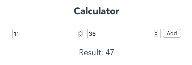
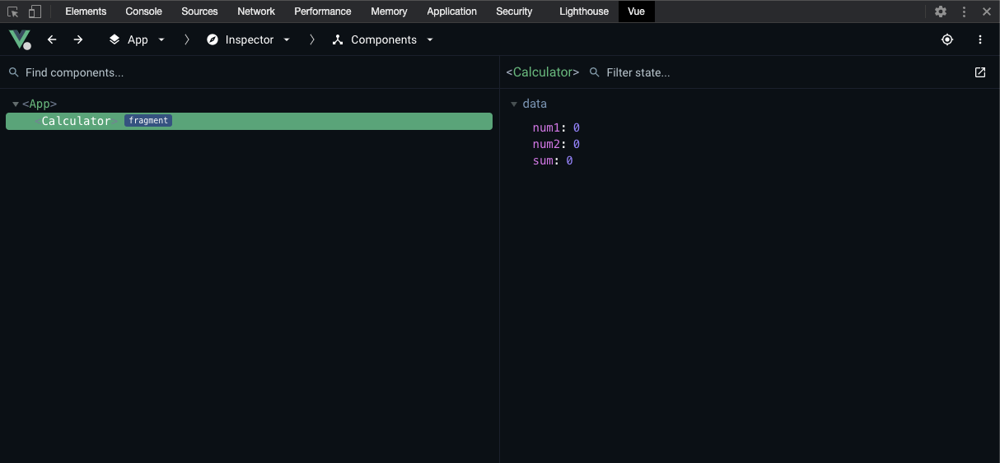

The long-awaited version 3.5 "Tengen Toppa Gurren Lagann" of the popular JavaScript framework Vue.js was officially released in September 2024. This version brings significant performance improvements and new features that further enhance the developer experience.

If you're wondering what the main features and most important innovations of Vue 3.5 are, you've come to the right place. In this tutorial, we'll show you not only the proven Composition API, but also new features like Reactive Props Destructure, `useTemplateRef()` and other optimizations.

The final release of Vue 3.5 was on September 1, 2024 and brought impressive performance improvements:

- **56% less memory usage** through optimizations of the reactivity system
- **Up to 10x faster** operations on large, deeply nested reactive arrays
- **New APIs** like `useTemplateRef()`, `onWatcherCleanup()` and `useId()`
- **Reactive Props Destructure** is now enabled by default

In this article, we will answer the following questions:

- What is Vue?
- What is the Composition API?
- What new features does Vue 3.5 bring?
- How do I use the new APIs effectively?

In this free online tutorial, we will create two versions of the same component: one with the Composition API, the other with the Options API, the current standard for writing components in Vue.js. If you want a more structured and hands-on introduction in the form of a training course, check out our <a target="_blank" href="https://workshops.de/seminare-schulungen-kurse/vuejs-typescript?utm_source=vuejs_de&utm_campaign=tutorial&utm_medium=portal&utm_content=text-top">Vue & TypeScript Intensive Training</a>.

## What is Vue?

Vue (or Vue.js) is an open-source JavaScript framework for frontend development.
Unlike other popular JavaScript frameworks, Vue is not backed by a large company like React (Facebook) or Angular (Google).
Vue was originally written by Evan You and is now maintained by a larger open-source community.

As with all common frameworks, Vue also works in a component-oriented way. An application is broken down into smaller parts (building blocks, components).
This creates easily reusable and maintainable units that are arranged in a hierarchical structure to assemble a larger application piece by piece.
Components thus form the fundamental building blocks of an application. The following graphic illustrates how a website can be broken down into components and related to each other in a tree structure:

[](https://v2.vuejs.org/v2/guide/#Composing-with-Components)

More information can be found in the official [Vue Documentation](https://v2.vuejs.org/v2/guide/#Composing-with-Components).

## What is the Composition API?

The most important thing first: The new API is purely additive, doesn't break existing code, and doesn't even have to be used!
You can continue to work with the Options API. The new Composition API is simply an extension of the existing framework to address limitations of Vue 2.x that particularly arose in large applications.
The Composition API provides a way to use Vue's familiar [Reactivity](https://v2.vuejs.org/v2/guide/reactivity.html) in all parts of the application without compromising organization and readability.

Essentially, the Composition API doesn't add anything new to the framework. It makes some of the originally internal functions available for direct use within and outside of components.

The term _Composition_ describes another essential part, namely the simplified construction of components. The new Composition API is a way of composing parts so that a component is created in the end.

## Why the new Composition API?

As Vue projects grow in size and complexity, the components within them have been difficult to maintain and manage. In Vue 2.x, components are organized using various options (_data_, _methods_, _computed_,...), hence the term _Options API_.
Additionally, there are numerous so-called _Lifecycle_ methods that can be added to react to and even intervene in certain situations.

Due to this division, components become difficult to read as they grow, since you often jump back and forth between individual sections to understand how they work.
Another disadvantage of this organization is that it makes code reuse difficult, since a feature can be scattered throughout the entire file. There are various workarounds, but they come with their own disadvantages.

Another important point is the current TypeScript support. The Options API relies on a lot of "magic" from the Vue compiler, which makes using `this` within components very difficult to combine with TypeScript.
The Composition API, due to its structure and simplicity, is free from these disadvantages, so it behaves as expected in JavaScript. This enables much better TypeScript support when using the Composition API.

## Vue 3

There are several ways to install Vue 3.
The Vue team provides an official [CLI](https://cli.vuejs.org) to set up applications. Since this is usually the optimal way, we'll do the same.
First, we install the CLI using the [Node Package Manager](https://docs.npmjs.com/getting-started):

```shell
npm install -g @vue/cli
```

Creating a new project is done with the following line:

```shell
vue create vue-3-5-tutorial
```

As a preset, we choose **Vue 3** here. Since Vue 3.5, we automatically benefit from the performance optimizations:

- **56% less memory usage** through an optimized reactivity system
- **Up to 10x faster** operations on large arrays
- Improved SSR performance and no more stale computed values

The setup and configuration of our new project then takes place. Once the process is complete, the next steps to run the Vue application are displayed:

```shell
cd vue-3-5-tutorial
yarn serve
# OR
npm run serve
```

The running application can be accessed in the browser via the displayed URL, which is [http://localhost:8080/](http://localhost:8080/) by default.

### 1. Bootstrapping the Application

The way a new Vue application is created has changed with version 3. To see this, let's take a closer look at the `src/main.js` file with any editor.

```javascript
import { createApp } from "vue";
import App from "./App.vue";

createApp(App).mount("#app");
```

Instead of `new Vue`, the `createApp` function is now used, which must first be imported.
The function receives our root component, i.e., the root of our application, as the first parameter.
The component can be defined here or imported as in the example application (`App.vue`).
Using the `mount` call and passing a CSS selector, we tell Vue where our application or component should be mounted in the DOM.

You can find the HTML file with the element with ID _app_ under `public/index.html`. Once the browser has downloaded and executed the HTML file and associated resources, our Vue application is loaded into the div element with the ID _app_.

### 2. Creating the First Component

We create a simple component for adding two numbers. The preliminary result looks like this:



In the `components` folder, we first create a new file called `Calculator.vue`:

```vue
<template>
  <h3>Calculator</h3>
  <form>
    <input type="number" />
    <input type="number" />
    <button type="submit">Add</button>
  </form>
  <p>Result:</p>
</template>
<script></script>
<style></style>
```

#### 1. The Structure of a Component

The file structure follows the well-known [Single-File-Component](https://v2.vuejs.org/v2/guide/single-file-components.html) schema, which is de facto the standard for Vue applications.

The `template` represents the HTML to be rendered for the component and can be enriched with [Directives](https://v2.vuejs.org/v2/guide/syntax.html#Directives) and [Interpolations](https://v2.vuejs.org/v2/guide/syntax.html#Interpolations) to implement the logic.
Almost all template engines work according to this principle.

The `script` part is used for the "more complex" JavaScript logic of the component and allows it to be configured.

Finally, the CSS rules for this component are stored in the `style` tag. However, if you don't use the [scoped](https://v2.vuejs.org/v2/guide/comparison.html#Component-Scoped-CSS) attribute, the rules specified there apply to the entire application. It's advisable to use a more advanced methodology like [BEM](http://getbem.com/introduction/).
Since this would go beyond the scope of this tutorial, we'll remove the `style` tags in the following and focus only on the component's logic.

#### 2. Writing the `script` Part

Our component needs three variables. `num1` and `num2` are needed for the user's input values, `sum` contains the result of the addition. We can assign several state variables to a component using the `data` option.

To do this, we extend the `script` part of the file as follows:

```javascript
export default {
  data() {
    return {
      num1: 0,
      num2: 0,
      sum: 0,
    };
  },
};
```

To perform the addition, we also use a method. This is declared in the `methods` option. The function must not be written as an [arrow function](https://developer.mozilla.org/en-US/docs/Web/JavaScript/Reference/Functions/Arrow_functions), otherwise we lose the reference to `this`.

```javascript
export default {
  data() {
    return {
      num1: 0,
      num2: 0,
      sum: 0,
    };
  },
  methods: {
    add: function () {
      this.sum = parseInt(this.num1, 10) + parseInt(this.num2, 10);
    },
  },
};
```

This example also shows the use of `this`. The Vue compiler ensures that options can access each other via `this` and that all variables defined in `data` are also initialized, making them available to the context.

Values in input fields are always represented as strings. Therefore, we need the [parseInt](https://developer.mozilla.org/en-US/docs/Web/JavaScript/Reference/Global_Objects/parseInt) method. This converts the input values to numbers.
The second parameter should always be used, as it specifies the underlying number system for the conversion. `10` stands for the common decimal system.

With that, the `script` part is initially complete. Next, we'll integrate the display control into the template.

#### 3. Enriching the `template` Part

First, we take care of outputting the result `sum`, since this is just a simple text interpolation. Vue uses the so-called _Mustache_ syntax, which is written with two curly braces:

```html
<template>
  <h3>Calculator</h3>
  <form>
    <input type="number" />
    <input type="number" />
    <button type="submit">Add</button>
  </form>
  <p>Result: {{ sum }}</p>
</template>
```

The Vue compiler renders the content of the variable from `data` in place of `sum`. But actually, more happens here. As users of the framework, we get out-of-the-box [reactivity](https://v2.vuejs.org/v2/guide/reactivity.html) of the properties.
Everything defined in `data` automatically receives a watcher. This triggers a re-rendering of the template when the variables defined there change.

In addition to outputting a currently still unchangeable sum of the addition, we should now focus more on linking the input fields with our other two variables `num1` and `num2`.

The template engine provides us with so-called directives for this, which apply side effects to the DOM. These special directives always start with the prefix `v-` and may only contain simple JavaScript expressions as values.

For our use case, we need a way to create a bidirectional binding between the input field and the associated variable. Vue provides us with the `v-model` directive for this:

```html
<template>
  <h3>Calculator</h3>
  <form>
    <input type="number" v-model="num1" />
    <input type="number" v-model="num2" />
    <button type="submit">Add</button>
  </form>
  <p>Result: {{ sum }}</p>
</template>
```

Vue then ensures that the user's inputs into the input field are reflected in the respective variable. Code-side changes to the variables also cause the input fields in the browser to be updated accordingly.

Finally, we still need to execute the addition when the button is clicked.
We can use the `v-on` directive to listen to DOM events with an [Event Listener](https://developer.mozilla.org/en-US/docs/Web/API/EventTarget/addEventListener). When the event is triggered, the specified JavaScript code is executed.
The type of event is specified after a colon.

```html
<template>
  <h3>Calculator</h3>
  <form v-on:submit.prevent="add">
    <input type="number" v-model="num1" />
    <input type="number" v-model="num2" />
    <button type="submit">Add</button>
  </form>
  <p>Result: {{ sum }}</p>
</template>
```

When clicking the button, we want to execute our `add` method to assign `sum` the value of the addition of `num1` and `num2`. This triggers a re-rendering of the component, causing `sum` to display the newly calculated value in the template.

An HTML form that contains a `button` of type `submit` is automatically submitted when clicked.
Alternatively, the form can also be submitted with _Enter_, which is the better solution for [accessibility](https://developer.mozilla.org/en-US/docs/Learn/Accessibility) reasons.
Therefore, it's not necessary to set a click listener on the button itself, but to intercept the `submit` event on the form.

The browser's default behavior when submitting a form leads to a redirect to the `action` specified in the form.
We want to handle the form and the entered data in JavaScript code on the current page and not trigger a redirect to another URL. Therefore, we prevent the default behavior at this point.

[Modifiers](https://v2.vuejs.org/v2/guide/events.html#Event-Modifiers) can be attached to an event listener via dot notation to automatically execute the associated logic.
In our case, it's `prevent`, which prevents the default behavior of the event before finally calling our `add` method. When the form is submitted, we prevent the redirect and instead pass the event to the specified JavaScript function.

The `v-on` directive can and should be replaced by the `@` character for better readability, so we get `@submit.prevent="add"`.

[[cta:training-top]]

#### Multi-Root Templates

Since Vue 3, thanks to a feature called _Fragments_, it's no longer mandatory to have only a single root element in the `template`.
This change means that the code shown above is now finally valid and you don't have to add an extra wrapping `div` element, as was the case in Vue 2.x.

### 3. Including Our Component

To test our component, we need to include and use it in our application. To do this, we open `src/App.vue` and first import our component by adding the following line in the `script` part above the `export`:

```javascript
import CalculatorApp from "./components/Calculator.vue";
```

We now register our component as such and make it known to the application. The Options API provides another property for this, namely `components`.

The `components` option is an object that contains the tag name as key and the component or its configuration object as value:

```javascript
export default {
  name: "App",
  components: {
    CalculatorApp,
  },
};
```

Here we use the [shorthand notation](https://developer.mozilla.org/en-US/docs/Web/JavaScript/Reference/Operators/Object_initializer#Property_definitions), which can be used since ECMAScript 2015 (ES6), by simply specifying `CalculatorApp`.

In the `template` part of our root component `App.vue`, we can now use `<CalculatorApp />` anywhere to render our component there:

```html
<template>
  <div id="app">
    <CalculatorApp />
  </div>
</template>
```

Due to the type of component registration used here, we can write the component in Single-File-Components (**SFC**) in both [Kebab Case](https://wiki.c2.com/?KebabCase) (`calculator-app`) and [Pascal Case](https://wiki.c2.com/?PascalCase) (`CalculatorApp`).

Normally, Kebab Case is preferred because this notation corresponds to the W3C standard and HTML is [case-insensitive](https://html.spec.whatwg.org/multipage/syntax.html). That means it doesn't distinguish between upper and lower case.
However, since we're using SFCs anyway and they're processed by the compiler beforehand, it's recommended to use Pascal Case notation in Vue applications for the following reasons, among others:

- Code editors can autocomplete component names because Pascal Case notation is also used in JavaScript.
- `<MyComponent />` differs more visually from standard HTML elements than `<my-component />`, as it stands out more due to the capital letters.

How Vue works internally and _what_ ultimately ends up in the browser from our Single-File-Components and _how_ can be read [here](https://medium.com/js-imaginea/the-vue-js-internals-7b76f76813e3) and [here](https://v2.vuejs.org/v2/guide/render-function.html).

### 4. The Vue DevTools

When working with Vue, the Vue DevTools are essential in addition to the tools you've learned about. It's an add-on for Chrome or Firefox browser that extends the developer tools with an additional area for Vue. This provides us with a lot of information about the application and the Vue components used.

- [Vue DevTools for Chrome](https://chromewebstore.google.com/detail/vuejs-devtools-beta/ljjemllljcmogpfapbkkighbhhppjdbg)
- [Vue DevTools for Firefox](https://github.com/vuejs/vue-devtools/releases/download/v6.0.0-beta.2/vuejs_devtools_beta-6.0.0.2-an+fx.xpi)

After installation and restarting the browser, we can open the developer tools using the keyboard shortcut [**Cmd+Option+I**] (Mac) or [**Ctrl+Shift+I**] (Windows). In the list of tabs, we look for the **Vue** entry and click on it:



In the figure, we see the component tree on the left, which contains the `App` component and below it our self-created `CalculatorApp` component.
On the right side, we see detailed information about the selected component.

### 5. New Features in Vue 3.5

Vue 3.5 brings some practical new features that we can use in our component. Let's get to know a few of them!

#### useTemplateRef() - The New Way to Use Template References

In Vue 3.5, there's a new, more type-safe method to access DOM elements. Let's extend our Calculator component with a function that automatically focuses the first input field:

```javascript
import { ref, computed, onMounted, useTemplateRef } from "vue";

export default {
  setup() {
    const num1 = ref(0);
    const num2 = ref(0);
    const sum = computed(
      () => parseInt(num1.value, 10) + parseInt(num2.value, 10)
    );

    // New Vue 3.5 API for template references
    const firstInputRef = useTemplateRef("firstInput");

    onMounted(() => {
      // Focus the first input field when the component loads
      firstInputRef.value?.focus();
    });

    return {
      num1,
      num2,
      sum,
    };
  },
};
```

And in the template, we add the `ref` attributes:

```html
<template>
  <h3>Calculator</h3>
  <form>
    <input type="number" v-model="num1" ref="firstInput" />
    <input type="number" v-model="num2" />
  </form>
  <p>Result: {{ sum }}</p>
</template>
```

The advantage of `useTemplateRef()` over the old method is that it's more type-safe and works better with TypeScript. The Vue Language Tools provide automatic completion and warnings based on the `ref` attributes in your template.

## Refactoring with the Composition API

For demonstration purposes, this fairly manageable component should suffice for now. In addition to some other innovations in Vue 3, we now want to deal with the Composition API.

The new API allows us to define components with a `setup` function instead of a large object consisting of predefined keys (options).
First, let's look at a refactoring of the previously created component with the Composition API, and then answer the last open question of the article: How does the Composition API work?

The functionality of the component is not changed by the refactoring, and the template remains completely unaffected.
As we'll see shortly, the rendering process cannot be influenced by the way the logic is defined.

### 1. Rewriting Component Logic

As mentioned above, with the Composition API, the way of configuring a component is reduced from a large object to a `setup` function. Accordingly, we start with a refactoring in the following schema:

```javascript
export default {
  setup() {},
};
```

Since Vue is supposed to get closer to the classic way of working of JavaScript developers with the Composition API, we declare the required variables and functions within the `setup` function as follows:

```javascript
export default {
  setup() {
    const num1 = ref(0);
    const num2 = ref(0);
    const sum = ref(0);

    function add() {
      sum.value = parseInt(num1.value, 10) + parseInt(num2.value, 10);
    }
  },
};
```

In principle, the existing code already looks like familiar JavaScript, which doesn't seem to be framework-agnostic. We do use `ref` and have to assign the variable via the `.value` statement, but none of this is atypical for JavaScript.

What has also changed is that we no longer use `this` to reference variables.
By using the API functions (`ref`) directly instead of through the options as in the previous example, the magic that otherwise takes place in the framework is abstracted away.

To make the code runnable, we of course still need to import `ref`, directly from Vue:

```javascript
import { ref } from "vue";

export default {
  setup() {
    const num1 = ref(0);
    const num2 = ref(0);
    const sum = ref(0);

    function add() {
      sum.value = parseInt(num1.value, 10) + parseInt(num2.value, 10);
    }
  },
};
```

With that, the refactoring is almost complete. Now we just assign the variables and functions to the template.

The procedure is the same as with other functions, because `setup` is also just a simple JavaScript function. All defined properties can be returned using a `return` statement.

```javascript
import { ref } from "vue";

export default {
  setup() {
    const num1 = ref(0);
    const num2 = ref(0);
    const sum = ref(0);

    function add() {
      sum.value = parseInt(num1.value, 10) + parseInt(num2.value, 10);
    }

    return {
      num1,
      num2,
      sum,
      add,
    };
  },
};
```

If we now switch back to the browser, we should still find the already known functionality.

## How Does the Composition API Work?

All the reactivity that is otherwise handled by the framework behind the scenes and made available to us as users almost magically out of the box is now usable via individual exported functions.

In the example, we see the use of `ref`. This way, we now make the variable **reactive**, so to speak, manually. The `ref` function accepts a value and then returns a [Reactive Reference](https://vuejs.org/api/reactivity-core.html).
The concept of working with such references runs through the entire Composition API. For web developers, it's important to understand the basic functionality.
A detailed description can be found in the following article: [The Composition API](https://vuejs.de/artikel/composition-api-teil-1/).

[Primitive data types in JavaScript](https://developer.mozilla.org/en-US/docs/Glossary/Primitive) (essentially non-`objects`, such as a `string`) are passed as copies and not as references.
This causes references to be "lost" when passed to functions, making it impossible to map reactivity. `ref`, on the other hand, creates an object from the initial value and thus enables values to be passed as references.

The returned object from `ref` has only a single property: `value` refers to the actual value of a reference and can also be used as a setter, as we can see in the example of the `add` function above.

The attentive reader may have noticed that we use `.value` exclusively in the JavaScript code, but not in the template itself. This is because the Vue compiler automatically performs the _unwrapping_, i.e., unpacking the value, in the template.

### `ref` vs. `reactive`

It's simpler when working directly with an object, since the problem with passing references doesn't exist for the reasons mentioned. If we were to create not three individual variables but work with a single object, the peculiarity with `.value` could be avoided as follows:

```javascript
import { reactive } from "vue";

export default {
  setup() {
    const state = reactive({
      num1: 0,
      num2: 0,
      sum: 0,
    });

    function add() {
      state.sum = parseInt(state.num1, 10) + parseInt(state.num2, 10);
    }

    return {
      state,
      add,
    };
  },
};
```

In the template, the uses of the variables would still need to be prefixed with `state.`, since they are now encapsulated in the `state` object.

The `reactive` function is basically the counterpart to `ref` for objects. It accepts an object and returns a proxy for that object that is tracked.
Here, the detour via `.value` is not necessary, since objects in JavaScript are passed by reference anyway and therefore no wrapper needs to be created.

For the rest of the tutorial, we'll continue working with `ref`.

## The Concept of `computed properties`

As mentioned at the beginning, the Composition API offers the developer an alternative for creating components.
Previously, we looked at the basic concepts and structure for writing components with the Options API and the Composition API.
The approach to calculating the sum here using a click listener and a function is not optimal. For these purposes, Vue offers us a much more powerful alternative, which we'll look at in this section.

With so-called `computed properties`, variables can be defined whose value depends on other (non-)reactive values. These variables are evaluated at runtime and updated as soon as one of the other values changes.

The Composition API also provides its own function for this:

```javascript
import { ref, computed } from "vue";

export default {
  setup() {
    const num1 = ref(0);
    const num2 = ref(0);
    const sum = computed(
      () => parseInt(num1.value, 10) + parseInt(num2.value, 10)
    );

    return {
      num1,
      num2,
      sum,
    };
  },
};
```

The `computed` function returns an _immutable_ (unchangeable) `ref` object whose value can also be accessed with `.value`. As a parameter, `computed` accepts a function.
We use an [arrow function](https://developer.mozilla.org/en-US/docs/Web/JavaScript/Reference/Functions/Arrow_functions) in shortened notation, which is why we don't need a `return` here to return the result of the addition.
`computed` can also accept an object with a setter function to make it mutable if needed.

Vue collects all variables used in the body as dependencies and automatically recalculates `sum` every time one of the values of these dependencies changes. In our case, that's `num1` and `num2`.

Furthermore, the value is cached and only recalculated when the value of one of the collected dependencies actually changes.
This means that even if there's a re-rendering of the component for another reason, Vue is smart enough not to recalculate the `computed properties` and simply output the previously stored value.

In contrast, a simple function is executed every time, since no dependency tracking takes place here.

Due to the changes made, we can modify the template as follows:

```html
<template>
  <h3>Calculator</h3>
  <form>
    <input type="number" v-model="num1" />
    <input type="number" v-model="num2" />
  </form>
  <p>Result: {{ sum }}</p>
</template>
```

As we can see, we no longer need the button or the event listener, since Vue automatically re-renders the component due to the reactivity of the variables and dependencies of the `computed property` as soon as we edit one of the input fields.

### `computed` Using the Options API

In a classic Vue component, we would write a `computed property` as follows:

```javascript
export default {
  data() {
    return {
      num1: 0,
      num2: 0,
    };
  },
  computed: {
    sum() {
      return parseInt(this.num1, 10) + parseInt(this.num2, 10);
    },
  },
};
```

With `computed`, we see another option of the configuration object from the Options API. We have removed `sum` as a variable from `data` and moved it to `computed`.
It's again an object in which `computed properties` are defined as functions.

Contrary to the syntax, we also don't use `sum` as a function call in the notation `sum()` in either the `script` or `template` part, but like a normal variable `sum`.

## Simplified Component Construction

In the introduction to the Composition API, better code organization and reuse of source code between components was mentioned as another major advantage of the new API.

The component created in this tutorial doesn't fully exploit the potential of the Composition API in this area, since we have only changed the structure of the component.
We can better recognize the benefit of the Composition API in terms of reusability of JavaScript logic when larger components are created or when it becomes necessary to share features across components.

In order not to exceed the scope of this tutorial and still be able to convey an impression of better code organization, we'll have to use a not quite optimal example.

### Adding More Functionality

If everything is moved to the `setup` method, we haven't really gained much.

At least one could argue so.

However, the opposite is the case.

The `setup` method no longer performs any magic in the background. We have built all the logic from simple JavaScript constructs enriched with smaller functions from the framework.
This gives us all the possibilities for structuring and dividing into partial functions.

To do this, we extend our `CalculatorApp` with another feature that is independent of the actual calculation.
We want to use the [numbers api](http://numbersapi.com) to display interesting facts about the calculated result.

Every time `sum` is recalculated, we want to have further logic executed. Vue also has a solution for this with [watchEffect](https://vuejs.org/api/reactivity-core.html#watcheffect).
Similar to `computed properties`, we can also specify a function here, which Vue analyzes and collects all reactive components as dependencies.
The specified function is executed immediately and automatically again whenever one or more dependencies change.

```javascript
import { computed, ref, watchEffect, onWatcherCleanup } from "vue";

export default {
  setup() {
    const num1 = ref(0);
    const num2 = ref(0);
    const fact = ref("");
    const sum = computed(
      () => parseInt(num1.value, 10) + parseInt(num2.value, 10)
    );

    watchEffect(async () => {
      // New in Vue 3.5: onWatcherCleanup for better cleanup management
      const controller = new AbortController();

      onWatcherCleanup(() => {
        // Cancel ongoing requests when sum changes
        controller.abort();
      });

      try {
        const res = await fetch(`http://numbersapi.com/${sum.value}`, {
          signal: controller.signal,
        });
        fact.value = await res.text();
      } catch (error) {
        if (error.name !== "AbortError") {
          console.error("Error fetching fact:", error);
          fact.value = "Error loading fact";
        }
      }
    });

    return {
      num1,
      num2,
      sum,
      fact,
    };
  },
};
```

With `fact`, we have added a new reactive property.
Since we use `sum.value` within `watchEffect`, Vue registers `sum` as a dependency of the effect and executes the specified function every time the value changes.

With the example, we also see the difference to `computed properties`. Since we first have to perform asynchronous operations like the API call here, after which further side effects are triggered, we have to make use of `watchEffect`.
`computed properties` are responsible for defining calculated variables that don't execute any further logic themselves.

Within the function, we use the API and pass the calculated sum as a parameter. We now add the output of the API result to the template:

```html
<template>
  <h3>Calculator</h3>
  <form>
    <input type="number" v-model="num1" />
    <input type="number" v-model="num2" />
  </form>
  <p>Result: {{ sum }}</p>
  <strong>{{ fact }}</strong>
</template>
```

We could have implemented the same behavior with the Options API, which is why we now want to look at the division into partial functions and thereby answer the question about the reusability of the Composition API.

### Composing a Component from `composition functions`

Our component obviously consists of two different features. For this reason, we divide our component into individual files. Then we can import and use them in the `setup` function of the component.

Under `src`, we create the `modules` folder with the two files:

- `use-addition.js` and
- `use-api.js`

It's not a fixed requirement, but a kind of convention to prefix such reusable `composition functions` with `use`.

In `use-addition.js`, we now outsource the logic needed for our calculation:

```javascript
import { ref, computed } from "vue";

export default () => {
  const num1 = ref(0);
  const num2 = ref(0);
  const sum = computed(
    () => parseInt(num1.value, 10) + parseInt(num2.value, 10)
  );

  return {
    num1,
    num2,
    sum,
  };
};
```

`use-api.js` contains the logic for the API request that was recently added:

```javascript
import { ref, watchEffect } from "vue";

export default (sum) => {
  const fact = ref("");

  watchEffect(async () => {
    const res = await fetch(`http://numbersapi.com/${sum.value}`);
    fact.value = await res.text();
  });

  return {
    fact,
  };
};
```

These types of functions are called `composition functions`, which are a central concept of the Composition API.

We can use Vue concepts like reactivity, `computed properties` and also `watchEffect` in our JavaScript files, even though we're not in the context of a component.
The logic is immediately clear because the files are small and easy to read.

We also gain the ability through the division of logic into individual files to reuse these `composition functions` at any time in other components or in other parts of the application.
We want to demonstrate this using our `CalculatorApp` component:

```javascript
import useAddition from "@/modules/use-addition";
import useApi from "@/modules/use-api";

export default {
  setup() {
    const { num1, num2, sum } = useAddition();
    const { fact } = useApi(sum);

    return {
      num1,
      num2,
      sum,
      fact,
    };
  },
};
```

The `setup` method is reduced to an absolute minimum. The properties needed in the template are provided to us by the outsourced functions.
However, we still need to return them using `return` in the component itself.

With [Destructuring](https://developer.mozilla.org/en-US/docs/Web/JavaScript/Reference/Operators/Destructuring_assignment), the returns of the `composition functions` are broken down into their individual components and written to the specified variables.
As with passing `sum` to `useApi`, without the concept of `refs` and `Reactive References`, we wouldn't be able to map the desired functionality of reactivity and would lose the references.

Through this concept of composing components, we get much better structuring and maintainability. The ability to finally structure components by logic is only possible to this extent with the Composition API.

## Script Setup and Reactive Props Destructure

Vue 3.5 makes development even more pleasant with the stable `<script setup>` syntax and the new **Reactive Props Destructure** feature. Let's modernize our Calculator component:

### Script Setup Syntax

The `<script setup>` syntax is a more compact way to write components:

```vue
<template>
  <h3>Calculator</h3>
  <form>
    <input type="number" v-model="num1" ref="firstInput" />
    <input type="number" v-model="num2" />
  </form>
  <p>Result: {{ sum }}</p>
  <strong>{{ fact }}</strong>
</template>

<script setup>
import {
  ref,
  computed,
  watchEffect,
  onWatcherCleanup,
  onMounted,
  useTemplateRef,
} from "vue";

// Everything here is automatically available in the template - no return needed!
const num1 = ref(0);
const num2 = ref(0);
const fact = ref("");
const sum = computed(() => parseInt(num1.value, 10) + parseInt(num2.value, 10));

// Template Ref with Vue 3.5 API
const firstInputRef = useTemplateRef("firstInput");

onMounted(() => {
  firstInputRef.value?.focus();
});

watchEffect(async () => {
  const controller = new AbortController();

  onWatcherCleanup(() => {
    controller.abort();
  });

  try {
    const res = await fetch(`http://numbersapi.com/${sum.value}`, {
      signal: controller.signal,
    });
    fact.value = await res.text();
  } catch (error) {
    if (error.name !== "AbortError") {
      fact.value = "Error loading fact";
    }
  }
});
</script>
```

### Reactive Props Destructure - New in Vue 3.5!

One of the most exciting innovations in Vue 3.5 is **Reactive Props Destructure**. Let's create a new component that uses props:

```vue
<!-- NumberDisplay.vue -->
<template>
  <div class="number-display">
    <h4>{{ title }}</h4>
    <p>The number is: {{ value }}</p>
    <p v-if="showDouble">Double is: {{ double }}</p>
  </div>
</template>

<script setup>
import { computed } from "vue";

// NEW in Vue 3.5: Props can be directly destructured and remain reactive!
const {
  value = 0, // With default value
  title = "Number", // With default value
  showDouble = false, // With default value
} = defineProps();

// The destructured props are reactive - the computed is automatically updated
const double = computed(() => value * 2);
</script>

<style scoped>
.number-display {
  padding: 1rem;
  border: 1px solid #ddd;
  border-radius: 4px;
  margin: 1rem 0;
}
</style>
```

Before Vue 3.5, we had to awkwardly use `withDefaults`:

```javascript
// Old (before Vue 3.5)
const props = withDefaults(
  defineProps<{
    value?: number
    title?: string
    showDouble?: boolean
  }>(),
  {
    value: 0,
    title: 'Number',
    showDouble: false
  }
)

// New (Vue 3.5) - much cleaner!
const {
  value = 0,
  title = 'Number',
  showDouble = false
} = defineProps<{
  value?: number
  title?: string
  showDouble?: boolean
}>();
```

### Using the New Component

Now we can use our `NumberDisplay` component in the Calculator app:

```vue
<!-- Calculator.vue -->
<template>
  <h3>Calculator</h3>
  <form>
    <input type="number" v-model="num1" ref="firstInput" />
    <input type="number" v-model="num2" />
  </form>

  <!-- New component with props -->
  <NumberDisplay :value="sum" title="Result" :show-double="sum > 10" />

  <strong>{{ fact }}</strong>
</template>

<script setup>
import {
  ref,
  computed,
  watchEffect,
  onWatcherCleanup,
  onMounted,
  useTemplateRef,
} from "vue";
import NumberDisplay from "./NumberDisplay.vue";

const num1 = ref(0);
const num2 = ref(0);
const fact = ref("");
const sum = computed(() => parseInt(num1.value, 10) + parseInt(num2.value, 10));

const firstInputRef = useTemplateRef("firstInput");

onMounted(() => {
  firstInputRef.value?.focus();
});

watchEffect(async () => {
  const controller = new AbortController();

  onWatcherCleanup(() => {
    controller.abort();
  });

  try {
    const res = await fetch(`http://numbersapi.com/${sum.value}`, {
      signal: controller.signal,
    });
    fact.value = await res.text();
  } catch (error) {
    if (error.name !== "AbortError") {
      fact.value = "Error loading fact";
    }
  }
});
</script>
```

## Conclusion

In this Vue.js online tutorial, you learned to write a component with Vue 3.5 on your own. In doing so, you not only learned the basic concept of working in Vue, but also tried out the latest features from Vue 3.5:

- The new `useTemplateRef()` API for type-safe template references
- **Reactive Props Destructure** for cleaner and more intuitive code
- `onWatcherCleanup()` for better resource management
- The modern `<script setup>` syntax for more compact components

Vue 3.5 also brings significant performance improvements - up to 56% less memory usage and up to 10x faster operations on large arrays. These optimizations make Vue an even better choice for modern web applications.

Compared to the classic Options API, you've seen how the Composition API together with the new Vue 3.5 features offers an even better developer experience. Reactive Props Destructure makes the code more readable, while APIs like `useTemplateRef()` and `onWatcherCleanup()` provide more type safety and better resource management.

Want to try out these new features yourself? The Composition API and all Vue 3.5 features are available now and production-ready!
Exchange ideas with other users in our free [Discord Chat](https://vuejs.de/discord)!

We are currently working on many more articles on Vue.js, especially the innovations of Vue 3.5 will be examined more closely on this site. So check back regularly to be the first to learn about all the news.
Happy learning!

If you need support, check out how our trainer David does the tutorial:

<iframe width="560" height="315" src="https://www.youtube.com/embed/pMr7P4QXj-E" frameborder="0" allow="accelerometer; autoplay; clipboard-write; encrypted-media; gyroscope; picture-in-picture" allowfullscreen></iframe>

[[cta:training-bottom]]
